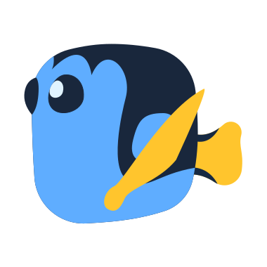

# Dory-Engine - Make Cloud-Native extremely easy, doryctl is CLI for Dory-Engine

- [English documents](README.md)
- [中文文档](README-zh.md)

- [Github](https://github.com/dory-engine/dory-dashboard)
- [Gitee](https://gitee.com/dory-engine/dory-dashboard)



For more detail please visit our official website: [https://doryengine.com](https://doryengine.com)

## What is `Dory-Engine`


- `Dory-Engine` is an engine to make your application to Cloud-Native infrastructure extremely easy. 

- Developers can publish applications from source code to kubernetes cluster without writing complicated kubernetes yaml deployment files.

### `Dory-Engine` Architecture


- Distributed: Dory-Engine uses a stateless design architecture and can be deployed in Kubernetes or docker to easily achieve distributed horizontal expansion and contraction.
- Containerization: Steps are executed in a remote step executor (Docker), which can easily achieve load sharing.
- High flexibility: The remote step executor (Docker) can perform horizontal expansion and contraction according to the workload to achieve high flexibility.
- Easy to expand: Through container technology, the steps can support various execution environments and realize the flexible expansion of the application cloud process.
- Multi-cloud orchestration: It can take over multiple different cloud native environments, host environments (native support for Enterprise Edition), various database environments (native support for Enterprise Edition), and publish applications to multiple different environments at the same time.
- Collaborative governance: Taking over the various components of the DevOps continuous delivery tool chain, automatically opening and configuring each component and cloud native environment, application to the cloud has never been easier.

## Install doryctl

### Binary (Cross-platform)

- Download the appropriate version for your platform from [doryctl Releases](https://github.com/dory-engine/dory-ctl/releases). Once downloaded, the binary can be run from anywhere. You don’t need to install it into a global location. This works well for shared hosts and other systems where you don’t have a privileged account.

- Ideally, you should install it somewhere in your PATH for easy use. /usr/local/bin is the most probable location.

### Build from source

- doryctl require golang version v1.16.x+

```shell script
# clone doryctl source
git clone https://github.com/dory-engine/dory-ctl.git

# build doryctl from source
cd dory-ctl
go mod tidy && go build -o doryctl
mv doryctl /usr/local/bin/
```

## Install Dory-Engine by doryctl

- Now we can use doryctl to install `Dory-Engine` with `docker-compose` (for test usage) or `kubernetes`(for production usage, recommended)

```shell script
##############################
please follow these steps to install dory-core with docker:

# 1. check prerequisite for install with docker
doryctl install check --mode docker

# 2. pull relative docker images from docker hub
doryctl install pull

# 3. print docker install mode config settings
doryctl install print --mode docker > install-config-docker.yaml

# 4. update install config file by manual
vi install-config-docker.yaml

# 5. install dory with docker
doryctl install run -o readme-install-docker -f install-config-docker.yaml

##############################
# please follow these steps to install dory-core with kubernetes:

# 1. check prerequisite for install with kubernetes
doryctl install check --mode kubernetes

# 2. pull relative docker images from docker hub
doryctl install pull

# 3. print kubernetes install mode config settings
doryctl install print --mode kubernetes > install-config-kubernetes.yaml

# 4. update install config file by manual
vi install-config-kubernetes.yaml

# 5. install dory with kubernetes
doryctl install run -o readme-install-kubernetes -f install-config-kubernetes.yaml
```

- For more detail:

```shell script
doryctl -h
```
